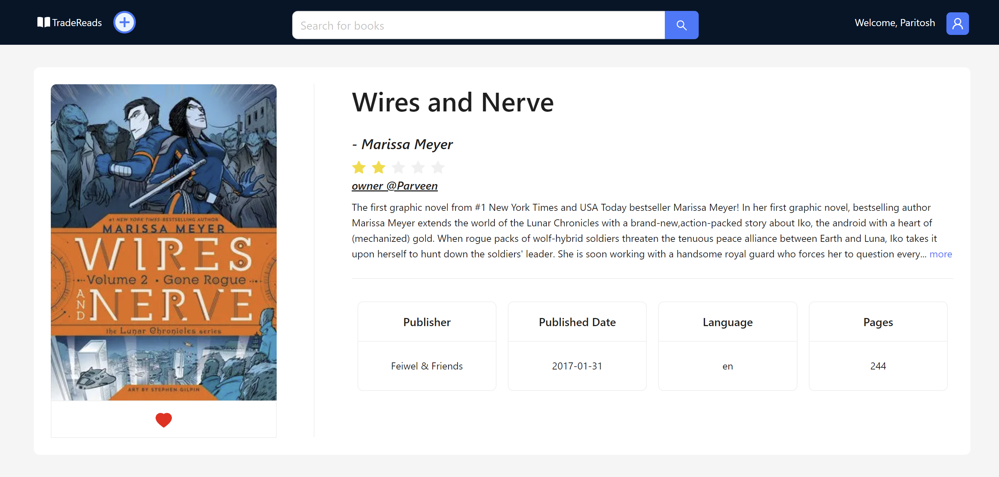
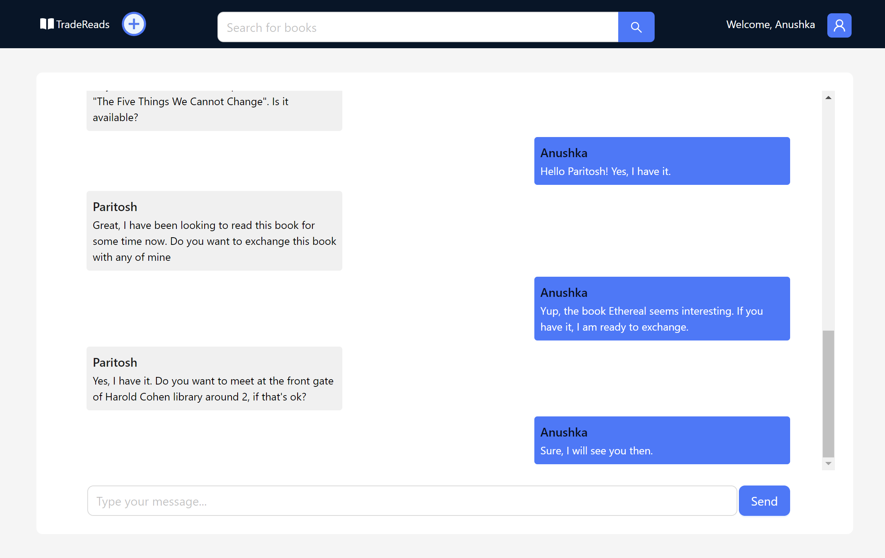

# TradeReads UI (Frontend)

This is the Next.js (React) frontend for the [TradeReads](../backend/README.md) book exchange platform. The UI enables users to browse, search, list, and wishlist books, as well as chat in real-time with other users. It is designed for seamless integration with the Django backend.

---

## Description

TradeReads UI provides a modern, responsive interface for discovering and exchanging books. Users can register, log in, add books (with Google Books API integration), manage wishlists, and communicate instantly with other users via real-time chat. The application leverages Ant Design for UI components, Tailwind CSS for styling, and WebSockets for chat.

---

## Features

- **User Authentication**: Register, login, and logout with JWT-based authentication.
- **Book Listings**: Browse, search, and add books. Book details are auto-filled using the Google Books API.
- **Wishlist**: Add books to your wishlist and view wishlisted books.
- **Real-Time Messaging**: Chat with other users using WebSockets.
- **Profile Avatars**: Display user avatars.
- **Responsive UI**: Built with Ant Design and Tailwind CSS.
- **API Integration**: Communicates with the Django backend via REST and WebSocket APIs.

---

## Tech Stack

- [Next.js](https://nextjs.org/) (TypeScript)
- [React](https://react.dev/)
- [Ant Design](https://ant.design/)
- [Tailwind CSS](https://tailwindcss.com/)
- [Heroicons](https://heroicons.com/)
- [Day.js](https://day.js.org/)
- [react-use-websocket](https://github.com/robtaussig/react-use-websocket)
- [socket.io-client](https://socket.io/)
- [Google Books API](https://developers.google.com/books)

---

## Getting Started

### 1. Clone the Repository

```bash
git clone <your-repo-url>
cd trade-reads-frontend
```

### 2. Environment Variables

Create a `.env.local` file in the root directory:

```env
NEXT_PUBLIC_API_HOST=http://localhost:8000
```

Set the value to your backend API host.

### 3. Install Dependencies

```bash
npm install
```

### 4. Run the Development Server

```bash
npm run dev
```

Open [http://localhost:3000](http://localhost:3000) to view the app.

---

## Project Structure

- `app/` — Main application code (pages, components, services)
- `public/` — Static assets and **screenshots**
- `types/` — TypeScript types

---

## Screenshots

Place screenshots in the `public/screenshots/` directory.  
Reference them in this section, for example:

```md



```

---

## Related Project

- [TradeReads Backend (Django Rest Framework)](../backend/README.md)

---

## License

MIT

---

## Contact

For questions or contributions, please open an issue or pull request.
